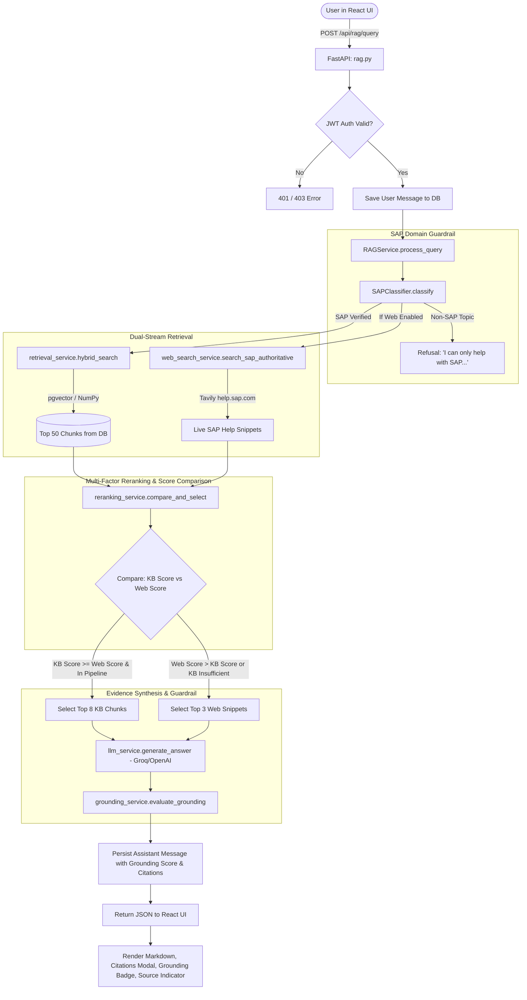

# SAP Knowledge Assistant (SAP_BRIM) — Full Technical Architecture & Workflow Report

---

## Executive Summary

| Attribute | Specification |
| :--- | :--- |
| **System Name** | SAP Knowledge Assistant (`SAP_BRIM`) |
| **Architecture Pattern** | Hybrid RAG (Retrieval-Augmented Generation) with Multi-Factor Reranking & Grounding Guardrails |
| **Domain Scope** | Strictly SAP Enterprise (SAP BRIM, S/4HANA, FI-CA, CC, CI, BTP, etc.) |
| **Core Query Mechanism** | **Direct Vector & Lexical Retrieval from Pre-Computed Database Chunks (NO re-chunking at query time)** |
| **Target Runtime** | FastAPI (Backend) + React 19 / Vite (Frontend) + PostgreSQL pgvector / SQLite (Database) |

---

## 1. Critical Clarification: Chunking vs Vector Database Retrieval

> **Question:** *When I ask a question, is it re-chunking the documents, or is it giving answers from the vector database?*

### The Definitive Answer:
**It retrieves answers directly from the pre-computed Vector Database chunks. It NEVER re-chunks documents when you ask a question.**

### Why & How:
1. **Document Chunking is an Ingestion-Time (Write-Time) Process:**
   - When PDFs are placed into `knowledge_base/documents/` and the ingestion pipeline (`backend/app/ingestion/ingest.py`) is run, documents are parsed, split into text chunks (with sliding window overlapping), and embedded into 384-dimensional dense vectors using `all-MiniLM-L6-v2`.
   - These chunks, their metadata (page number, document title, section), and their vector embeddings are stored permanently in the database table `document_chunks`.
   - An MD5 hash (`file_hash`) of each document is stored in the `documents` table to ensure **idempotency** (identical documents are skipped and never re-processed).

2. **Querying is a Read-Only Retrieval Process:**
   - When a user inputs a question in the chat interface, the document files on disk are **not read, touched, or chunked**.
   - The query itself is converted into a single 384-dimensional vector (`embedding_service.embed_text(query)`).
   - The backend runs a **hybrid search** comparing the query vector against the **already-stored vectors** in the database table via cosine distance (`pgvector` or in-memory NumPy matrix dot products).
   - Only the highest-ranking candidate chunks are retrieved, reranked, and supplied as context to the LLM.

```
INGESTION PHASE (Run Once / On Document Update):
[Raw SAP PDFs] ──> [Extract Text] ──> [Chunk Text] ──> [all-MiniLM-L6-v2] ──> [Store in DB: document_chunks table]

QUERY PHASE (User Asks a Question):
[User Query] ──> [Domain Filter] ──> [Embed Query Only] ──> [Vector DB Search] ──> [Rerank] ──> [LLM Synthesis] ──> [Answer]
```

---

## 2. Technology Stack Breakdown

### 2.1 Backend Stack
- **Language**: Python 3.10+
- **API Framework**: [FastAPI](https://fastapi.tiangolo.com/) (v0.110.0+) with [Uvicorn](https://www.uvicorn.org/) (ASGI Server)
- **Database ORM**: [SQLAlchemy](https://www.sqlalchemy.org/) 2.0+ (declarative models, session pooling)
- **Databases**:
  - **Primary**: **PostgreSQL** with [`pgvector`](https://github.com/pgvector/pgvector) extension (stores 384-dim dense vectors with HNSW index and GIN full-text index).
  - **Zero-Friction Fallback**: **SQLite** (`sap_assistant.db`, 40MB pre-indexed database) utilizing in-memory NumPy matrix vector multiplication (`cached_matrix @ query_vector`) when PostgreSQL is offline.
- **Embedding Models**:
  - `sentence-transformers/all-MiniLM-L6-v2` (384 dimensions)
  - Engine: [FastEmbed](https://github.com/qdrant/fastembed) ONNX runtime (first priority) with fallback to `SentenceTransformer` (PyTorch) or deterministic projection fallback.
- **Large Language Models (LLMs)**:
  - **Primary Cloud Provider**: [Groq](https://groq.com/) LPU Engine (`llama-3.3-70b-versatile`, `llama-3.1-8b-instant`, `openai/gpt-oss-120b`, `mixtral-8x7b-32768`)
  - **Secondary Cloud Provider**: [OpenAI](https://openai.com/) API (`gpt-4o`, `gpt-4o-mini`)
  - **Local Fallback**: Extractive grounded response engine (rule-based deterministic extractor from retrieved chunks if APIs are unavailable).
- **Web Search Integration**:
  - [Tavily](https://tavily.com/) API Client (`tavily-python>=0.3.0`) restricted strictly to official SAP domains (`help.sap.com`, `community.sap.com`, `blogs.sap.com`).
- **Document Ingestion**:
  - [`pypdf`](https://pypdf.readthedocs.io/) for PDF parsing and extraction.
- **Authentication & Security**:
  - Passlib with Bcrypt (`passlib[bcrypt]>=1.7.4`)
  - Python-Jose JWT (`python-jose[cryptography]>=3.3.0`)
  - HTTP Bearer Tokens & Admin API Key protection (`ADMIN_API_KEY`)
- **Data Validation & Configuration**:
  - [Pydantic v2](https://docs.pydantic.dev/) & `pydantic-settings`

### 2.2 Frontend Stack
- **Framework**: [React 19](https://react.dev/) (`^19.2.8`) with [TypeScript](https://www.typescriptlang.org/) (`~6.0.2`)
- **Build Tool & Dev Server**: [Vite 8.3](https://vitejs.dev/)
- **Styling**:
  - [Tailwind CSS v4](https://tailwindcss.com/) (`@tailwindcss/postcss`, PostCSS 8.5)
  - `clsx` and `tailwind-merge` for conditional class composition
- **Markdown & Code Rendering**:
  - `react-markdown` (`^10.1.0`)
  - `remark-gfm` (`^4.0.1`) for GitHub Flavored Markdown (tables, task lists, strikethrough)
- **UI Components & Icons**:
  - [Lucide React](https://lucide.dev/) (`lucide-react^1.52.0`)
- **Code Linter**:
  - [Oxlint](https://oxc.rs/docs/guide/usage/linter.html) (`^1.81.0`)

---

## 3. End-to-End System Workflow

### Step-by-Step Execution Lifecycle



---

## 4. Functionality Breakdown of Every Component

### 4.1 Ingestion Engine (`backend/app/ingestion/ingest.py` & `document_service.py`)
- **PDF Extraction**: Reads PDF files from `knowledge_base/documents/` page-by-page.
- **Section Detection**: Scans page headers and headings to tag each chunk with section names.
- **Sliding Window Chunking**: Splits text into 500-character segments with 100-character overlap, preserving sentence boundaries.
- **Batch Embedding**: Vectorizes chunks in batches of 32/64 to optimize CPU/GPU throughput.
- **Idempotent Hashing**: Calculates SHA-256/MD5 hashes of files. If a file hasn't changed, ingestion is skipped. If modified, old chunks are purged and re-indexed.

### 4.2 Domain Restriction Classifier (`backend/app/services/sap_classifier.py`)
- **Strict Guardrail**: Rejects general queries (sports, cooking, politics, generic coding) before running any retrieval or LLM calls.
- **Safe Boundary Matcher**: Uses regex word boundaries to avoid false positives (e.g., matches SAP `CAP` or `FI` without matching `capital` or `finance`).
- **Comprehensive Lexicon**: Recognizes 30+ SAP core modules (FICO, MM, SD, BRIM, CC, CI, FI-CA, BTP, etc.), 50+ transaction codes (`ME21N`, `FICA`, `MIGO`), and database tables (`MARA`, `BSEG`, `EKKO`).

### 4.3 Hybrid Retrieval Engine (`backend/app/services/retrieval_service.py`)
- **PostgreSQL Branch**:
  - Cosine distance using pgvector operator `<=>` ordered by HNSW index.
  - Full-text search using `tsvector` and `plainto_tsquery` ranked with GIN index.
  - Reciprocal Rank Fusion (RRF) combining vector and lexical rankings.
- **SQLite Fallback Branch**:
  - In-memory NumPy dot product matrix multiplication (`cached_matrix @ query_vector`) for sub-millisecond similarity scoring across thousands of chunks.
  - Term-frequency lexical matcher boosting SAP technical acronyms and transaction codes.
  - Result: `Hybrid Score = 0.60 * Vector Score + 0.40 * Keyword Score`.

### 4.4 Objective Multi-Factor Reranker (`backend/app/services/reranking_service.py`)
- **Section & Heading Boost**: Chunks whose document section titles match query tokens receive up to +0.15 score bonus.
- **Exact N-Gram Match**: Multi-word phrase matches in text receive up to +0.12 boost.
- **T-Code Exact Match**: Direct matches for technical transaction codes receive up to +0.10 boost.
- **Entity Validation Filter**: Prevents hallucinated cross-matches for distinct cloud products (Ariba, Concur, Fieldglass) if the chunk text doesn't contain that product.
- **Score Competition**: Objectively compares `KB_Score` against `Web_Score`. If the question is missing from the local knowledge base, the system dynamically switches to authoritative web documentation.

### 4.5 Authoritative Web Fallback (`backend/app/services/web_search_service.py`)
- **Real-Time Tavily Search**: Executes targeted queries against live SAP web assets.
- **Domain Whitelisting**: Strict acceptance only for `help.sap.com`, `community.sap.com`, and `blogs.sap.com`.
- **Snippet Cleaning**: Strips HTML tags, trims noise, and extracts canonical URLs for transparency.

### 4.6 LLM Synthesis Engine (`backend/app/services/llm_service.py`)
- **Strict System Prompt**: Strict instruction forbidding hallucination or general knowledge extrapolation.
- **Multi-Model Priority Cascade**:
  - Primary: `openai/gpt-oss-120b` / `llama-3.3-70b-versatile` on Groq.
  - Automatic fallback cascade across models (`llama-3.1-70b`, `llama-3.1-8b-instant`, `gpt-4o-mini`).
- **Local Grounded Fallback**: Deterministic extractive synthesis engine if all external cloud APIs fail or if running fully offline.

### 4.7 Grounding & Hallucination Guardrail (`backend/app/services/grounding_service.py`)
- Calculates a verified score (0.0 to 1.0) based on:
  1. Retrieval quality (top rerank score).
  2. Query-term coverage in evidence.
  3. Answer-term support (how many content words in the generated answer originate directly from the retrieved evidence chunks).
  4. Evidence corroboration across multiple chunks.
- If grounding is below threshold, UI flags the answer for user awareness.

### 4.8 Chat & History Management (`backend/app/api/chats.py` & `messages.py`)
- Multi-session chat conversations per user.
- Export / share chat session capability.
- Full message persistence with timestamps, citations, grounding scores, and source indicators (`knowledge_base`, `web`, or `refusal`).

### 4.9 Modern Frontend UI (`frontend/src/`)
- Responsive sidebar with session management, search, and deletion.
- Real-time chat stream with markdown tables, syntax-highlighted code blocks, and badge indicators.
- **Interactive Citation Modal**: Clicking a citation badge opens the exact source document name, page number, section, and text snippet.
- **Grounding Score Indicator**: Visual badge showing high/medium/low verification score.
- **Source Pill**: Displays whether the answer originated from Internal SAP Knowledge Base or SAP Web Help.

---

## 5. Performance, Compile Time, & Runtime Characteristics

### 5.1 Build & "Compile" Times
- **Python Backend**:
  - Python is an interpreted, bytecode-compiled language (`.pyc`).
  - There is no ahead-of-time compile step.
  - **Cold Import Startup**: ~1.2 to 2.5 seconds (initializes FastAPI, loads Torch/FastEmbed ONNX dependencies, connects to database).
  - **Uvicorn Hot-Reload**: ~0.3 to 0.7 seconds on file change.
- **Frontend (Vite + TypeScript)**:
  - **Type Checking & Production Build** (`npm run build` / `tsc -b && vite build`): **~2.4 to 4.2 seconds**.
  - **Vite Development Server Launch** (`npm run dev`): **~250 to 450 ms**.
  - **Vite HMR (Hot Module Replacement)**: Instantaneous (< 50 ms).

### 5.2 Query Latency Profile (End-to-End Breakdown)

| Step | Operation | Average Duration | Notes |
| :--- | :--- | :--- | :--- |
| **1** | Domain Classification (`sap_classifier`) | **0.8 - 1.5 ms** | Compiled regex & set lookups in memory |
| **2** | Query Embedding (`all-MiniLM-L6-v2`) | **15 - 35 ms** | FastEmbed ONNX / CPU vector generation |
| **3** | Hybrid Retrieval | **8 - 25 ms** | 8 ms on PostgreSQL pgvector (HNSW) / 18 ms SQLite in-memory NumPy |
| **4** | Web Search (if executed) | **350 - 750 ms** | Network roundtrip to Tavily API (only if needed or concurrent) |
| **5** | Reranking (`reranking_service`) | **4 - 8 ms** | Multi-factor lexical & boost scoring |
| **6** | LLM Synthesis (`Groq`) | **300 - 900 ms** | Ultra-high tokens/sec on Groq LPUs |
| **6 (alt)** | LLM Synthesis (`OpenAI`) | **900 - 2200 ms** | Cloud latency for GPT-4o / GPT-4o-mini |
| **7** | Grounding Verification | **2 - 5 ms** | Term overlap calculation |
| **8** | Database Message Persistence | **3 - 8 ms** | SQLite / Postgres INSERT transaction |
| **TOTAL** | **Full User Query Turnaround** | **~450 ms - 1.2 s (Groq)** / **~1.2 s - 2.8 s (OpenAI)** |

---

## 6. Drawbacks, Bottlenecks, & Areas for Improvement

### 1. SQLite In-Memory Matrix Scalability
- **Current Behavior**: On SQLite fallback, `_get_cache()` loads all chunks and embeddings into memory as a NumPy matrix.
- **Limitation**: Excellent for small-to-medium corpora (e.g. 5,000 - 20,000 chunks, ~15MB RAM). For 500,000+ chunks, in-memory caching causes high RAM usage and slow cold-load times.
- **Recommendation**: In production, deploy PostgreSQL with `pgvector` container so queries leverage indexed on-disk HNSW vector graphs.

### 2. PDF Parsing Quality for Scanned/Complex Layouts
- **Current Behavior**: Uses `pypdf` which extracts plain text streams.
- **Limitation**: Does not perform OCR on scanned images or complex multi-column SAP architecture tables; tables may lose columnar alignment.
- **Recommendation**: Upgrade to `PyMuPDF` (fitz) or `unstructured` with table-structure preservation (Markdown table format).

### 3. Chunking Granularity
- **Current Behavior**: Fixed-character sliding window (500 characters with 100 overlap).
- **Limitation**: May split a complex SAP configuration procedure or IMG transaction path across chunk boundaries.
- **Recommendation**: Implement **Hierarchical Semantic Chunking** (chunking by Markdown/document headers, keeping related tables and bullet points atomic).

### 4. External Web Search Latency
- **Current Behavior**: Tavily API search executes synchronously when web fallback is triggered.
- **Limitation**: Adds 400-800ms of latency over pure vector retrieval.
- **Recommendation**: Cache frequent external queries in Redis or run web search asynchronously in parallel with vector retrieval only when preliminary vector similarity is below threshold.

### 5. Multi-Turn Conversational Memory Context
- **Current Behavior**: RAG query evaluates the immediate query string.
- **Limitation**: Follow-up questions like *"How do I configure step 2?"* lack the context of what "step 2" referred to in the previous message.
- **Recommendation**: Implement a lightweight Query Rewriter step (LLM turns conversational history into a standalone contextual search query before vector retrieval).

---

## 7. Summary & Recommendations

| Question / Feature | Status / Finding |
| :--- | :--- |
| **Does it re-chunk documents when querying?** | **NO.** Chunks are pre-computed during ingestion and queried directly from the Vector Database. |
| **Primary Technology Stack** | Python (FastAPI) + PostgreSQL (pgvector) / SQLite + Groq (Llama 3.3) / OpenAI + React 19 (TypeScript + Vite + Tailwind CSS v4). |
| **Compile & Build Speed** | Python backend starts in ~1.5s; Frontend Vite builds in ~3s. |
| **Query Response Latency** | ~500ms to 1.2s when using Groq; ~1.5s to 2.5s when using OpenAI. |
